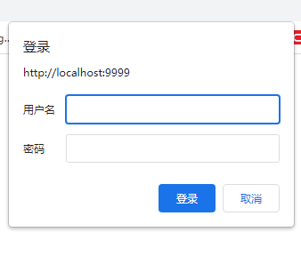
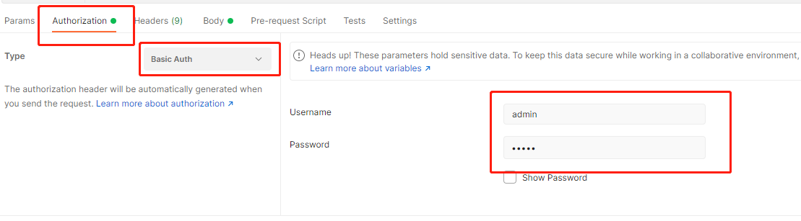
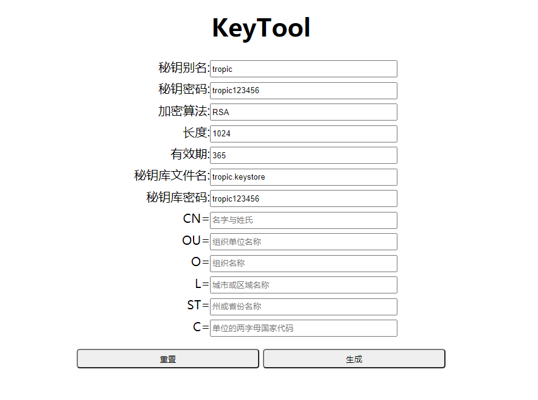

=============
引子
=============

这个章节里我们要展开什么内容呢？准确的说，这部分内容不同于之前的简单使用帮助说明。

* 假如你的程序已经部署上线了，那怎么样才能不停止服务器的情况下来进行升级个别服务端小程序呢？或者说，这种行为叫做打补丁。

* 打补丁的安全如何保障？

* 假如你想要临时停掉某个Http-Path的服务端小程序，这又该怎么办呢？

* 假如你想恢复停掉的那个Http-Path的服务端小程序，怎么办？

* 假如你不想用Tropic来开发Web程序，只想用它来一些控制台小程序，又该如何呢？

我们有这么多假如，那么就来看Tropic是如何做到的吧。

=========
动态热部署
=========

热部署
-------

无需编译，热部署，总会有无数程序员讨厌编译的繁琐，对着这两大特性垂涎三尺。其实呢，JVM作为一个中间代码解释器，本身就是支持热部署的，有很多字节码
处理框架完全可以在运行时来改变某个Java类的结构和方法，这一点在面向切面技术领域已经屡试不爽了。由于Tropic本身不使用Java字节码技术，而是简单的
使用Java的Javascript引擎能力，所以热部署这个能力就浑然天成了。

接下来演示下，热部署的效果。我们创建个服务端小程序hot.js，其内容如下:

.. code-block:: javascript

    //path: /hot
    var hot = {
        service: function (req, resp) {
          resp.body.append("我喜欢简单。");
          return resp;
        }
    };

我们完成配置后，启动服务器，访问http://localhost:9999/hot。将会在浏览器看到：

.. code-block:: javascript

    {"code":200,"msg":"","body":"我喜欢简单。"}

现在，我们将小程序的代码改以下内容:

.. code-block:: javascript

    //path: /hot
    var hot = {
        service: function (req, resp) {
          resp.body.append("我喜欢热部署能力。");
          return resp;
        }
    };

此时，只需要保存以上代码，在不重新启动服务器的同时，我们重新刷新浏览器，我们将在浏览器看到以下内容:

.. code-block:: javascript

    {"code":200,"msg":"","body":"我喜欢热部署能力。"}

不用为之惊叹，就是这么任性。此时此刻，是不是有点PHP的意思了？原来Java给我们留着这么大的一个惊喜，可是却鲜有人去挖掘。这么爽的特性，显然要比频繁
重启好使多了。

动态绑定
---------

动态绑定能力是指允许程序运行期间，动态的将服务端小程序绑定到某个预期的Http-path上来提供服务。我们这里拿之前的hot.js接着举例示范。当然，首先要记得
在我们的config.js中打开这个黑科技。具体配置如下：

.. code-block:: javascript

    server:{
        use_dynamic_bind:true,
        auth_bind_token:"Tropic"
    }

另外，我们还需要准备一个Http-Client测试工具，比如Postman。一切准备就绪后，我们打开Postman。假设，我们需要另一个/sohot路径提供和/hot同样的能力
那么此时，我们准备好以下内容：

动态绑定功能的服务地址是 http://localhost:9999/@bind

我们要发送的报文内容是:

.. code-block:: javascript

    {
    "path":"/sohot",
    "servlet":"./servlet/hot.js",
    "name":"hot"
    }

准备好这些还不够，因为处于安全考虑，我们必须携带token才可以成功请求。token是携带在http请求头里的，其名称为js$auth_bind_token，我们在Postman
设置js$auth_bind_token对应的值为:Tropic。最后，还有一点需要注意，否则是无法成功的。处于安全考虑，由于POST请求太过普通，所以这个动态绑定的功能
使用了PUT请求作为准入限制，请一定记得设置HTTP请求方法为PUT。一切都准备好后，我们用Postman发起请求，不出意外将返回以下内容:

.. code-block::javascript

    {
    "code": 200,
    "msg": "bind for path: /sohot",
    "body": ""
    }

当我们收到这样的返回结果时就代表我们已经绑定成功了，此时，我们访问浏览器地址http://localhost:9999/sohot，将看到以下内容:

.. code-block::javascript

    {"code":200,"msg":"","body":"我喜欢热部署能力。"}

那么如何解绑定呢？

其实解绑定和绑定的动作很相似，地址都是/@bind路径来提供服务，只是解绑定的时候我们需要使用HTTP的DELETE请求方法，请求头里依然要携带令牌，但是
请求体里可以只携带一个path属性即可。

.. code-block:: javascript

    {
    "path":"/sohot"
    }

特别需要注意的是，所有动态绑定的小程序路径，在服务器重启后自动失效。

动态打补丁
---------

动态绑定能力已经很强大了，对吧？但其实，更强大的是动态打补丁的能力。这个功能准确的描述来说，是指当你已经上线了一套服务端应用，此时你无法到到服务器上
更换所有的源代码了，这时候就该动态打补丁的功能闪亮登场了。这个功能允许你上传一个服务端程序源代码，并且完成绑定到一个固定的Http路径上来提供服务。
警告，这个功能已经和黑客所熟知的WebShell有些类似了，是个强大但危险的功能。

那我们接下来具体介绍如何使用这个强大的打补丁功能吧。假设你有以下源代码想要提交到服务器上提供Http服务。

.. code-block:: javascript

    //path: /door.jsp
    var hot = {
        service: function (req, resp) {
          resp.body.append("我是个补丁。我更像个后门。");
          return resp;
        }
    };

源代码准备好后，我们打开Postman，键入之前的动态绑定地址http://localhost:9999/@bind。将源代码黏贴在body输入区域中。此外，我们还有好多Http
-header要进行设置，因为我们要高速服务端这个源代码存放的文件名，服务的路径等等。那么Http-header里要填写哪些内容呢？

* js$path 要服务的Http路径 此处示例应该填写/door.jsp
* js$servlet 源代码在服务器上的文件名 此处示例应该填写 hot.js
* js$name 源代码中声明的变量名称 此处示例应该填写 hot
* js$auth_bind_token  安全令牌  此处示例应该填写 Tropic

以上信息都设置好后，我们将HTTP请求方法调整为PATCH，然后点击Postman发送按钮。一切万事大吉后，我们将收到：

.. code-block:: javascript

    {
        "code": 200,
        "msg": "patch for path: [/door.jsp]",
        "body": ""
    }

此时，我们的补丁源码就会发送到服务器上，并且开始为Http路径为 /door.jsp的地址提供服务。

特别需要注意的是，所有的补丁程序在服务器重启后将会全部失效，但是/patch目录下将会保留所有的源代码文件。因为补丁终究是补丁，补丁的服务都应该是临时的
当服务器需要重启的时候，应该已经达到了人工介入更新整体服务应用的时机。

========================
$.format和$.asMapList
========================

这两个能力在之前的章节中的示例源代码里出现过，那么到底是什么意思呢？

这里，就展开解释下Tropic框架集成的查询关系数据库的依赖jar包commons-dbutils。commons-dbutils是Apache的一个开源数据库访问处理工具包，提供了
简单易用的一些API封装，感兴趣的可以访问:https://commons.apache.org/proper/commons-dbutils/
其核心工具类主要是两个，一个是QueryRunner，另一个是ResultSetHandler，这两个一个负责执行SQL，另一个负责将查询出的数据进行处理。在官方提供的ResultSetHandler
里有一个MapListHander实现，作用是将查出的每一行数据处理成一个Map，列名作key，列值做value，多行数据经过转换后放进一个ArraList里。$.asMapList就是一个
语法糖，免去了写代码时new MapListHandler()的操作。

那$.format是干啥呢？为什么要用$.format呢？$.format是想做一个通用格式化的封装，目前呢主要是用来格式化MapListHandler返回的数据结构，因为数据库中难免
会有些Date和Datetime类型的字段，这些类型是没有办法直接映射成Js变量类型的，在进行toJson的时候会有些问题，所以就需要对齐进行一个预处理。这个函数会
默认将数据库Date列格式化成为yyyy-MM-dd，将数据库Datetime列格式化为yyyy-MM-dd HH:mm:ss格式。

.. code-block:: javascript

    function (maplist) {
        var list = [];
        for (var item in maplist) {
            var row = {};
            for (var key in maplist.get(item)) {
                var val = maplist.get(item).get(key);
                if (val != null && typeof val == "function") {
                    if (val instanceof LocalDateTime) {
                        row[key] = val.format(DateTimeFormatter.ofPattern("yyyy-MM-dd HH:mm:ss"));
                    } else if (val instanceof LocalDate) {
                        row[key] = val.format(DateTimeFormatter.ofPattern("yyyy-MM-dd"));
                    }
                } else {
                    row[key] = val;
                }
            }
            list.push(row);
        }
        return list;
    }

看了上面的实现代码，很容易就理解了。经过这一系列的转换之后呢，Java的类型就被抹掉了取而代之的是一个填满了Json-Object的数组。在后面的数据使用时
我们就可以使用对象导航的方式了。

最后，补充要说的是，commons-dbutils的功能很强大，有很多ResultSetHandler的默认实现，也提供了POJO类到查询结果集的自动化ORM处理工具类，我们来看下
官网的示例代码。

.. code-block:: java

    QueryRunner run = new QueryRunner(dataSource);

    // Use the BeanListHandler implementation to convert all
    // ResultSet rows into a List of Person JavaBeans.
    ResultSetHandler<List<Person>> h = new BeanListHandler<Person>(Person.class);

    // Execute the SQL statement and return the results in a List of
    // Person objects generated by the BeanListHandler.
    List<Person> persons = run.query("SELECT * FROM Person", h);

上面的代码是映射成POJO类的集合，可是在Tropic框架的使用背景下，我们需要思考个问题，用JS也要强制按照Java实体类那样去写实体类吗？包括Getter和Setter？
这是个问题，没有答案，没有标准，只有适合不适合，我们完全可以根据自己的实际情况来做出开发规范。

==================================
三层架构(Controller/Service/Dao)
==================================

以往，我们用Spring开发JavaWeb应用，基本上清一色的Controller->Service->Dao。那么用Tropic开发，还需要吗？其实，这里完全可以沿用之前的分层架构去写代码。

* Controller

.. code-block:: javascript

    var person_ctrl={
      service:function (req,resp){
          println($.toJson(resp));
          load("./servlet/demo/person_service.js");
          if(req.params){
              var id=req.params.get("id");
              if(id==null){
                  resp.code=500;
                  resp.msg.append("id不可以为null");
              }else{
                 var rst= person_service.queryOneById(id);
                 resp.body=rst;
              }
              return resp;
          }else{
              resp.code=500;
              resp.msg.append("请携带id参数查询");
              return resp;
          }
      }
    };

* Service

.. code-block:: javascript

    var person_service = {
        queryOneById: function (id) {
            load("./servlet/demo/person_dao.js");
            var sql="select * from person where id = "+id;
            var rst=person_dao.query(sql);
            return rst;
        }
    };

* DAO

.. code-block:: javascript

    var person_dao = {
        query: function (sql) {
            var conn=$.jdbc();
            var rn=$.sql();
            var obj=rn.query(conn,sql,$.asMapList);
            obj=$.format(obj);
            $.jdbc(conn);
            return obj;
        }
    };

上面我们展示了三层架构的方式来写代码，当然这些示例代码都很简陋。不过，我们需要注意load方法，这个方法是将我们三个代码源文件串起来的函数，由于我们
每个源文件都是声明式的对象变量，所以我们想使用就需要加载进来。另外，必须要从应用的根级目录来进行加载./就是指当前的框架home目录。

========================
setInterval和setTimeout
========================

通常，我们在JS代码中用到定时刷新，或者延迟执行的场景是，我们会用到这两个函数。在Tropic里，也同样做了支持。

.. code-block:: javascript

    $.setInterval(function(){
        println("Hello ,i'm in 'Interval'");
    },2000);

    $.setTimeout(function(){
        println("Hello ,i'm in 'Timeout'");
    },2000);

以上代码已经清楚的展示了，这两个函数的使用方法，相信不用再啰嗦解释了。

===============
访问非关系型数据库
===============

访问MongoDB
-----------

MongoDB是业内比较知名的NoSQL数据库，这里不做点评，只展示如何集成MongoDB并完成数据操作等等。老规矩，上代码:

.. code-block:: javascript

    var mongo_servlet = {
    service: function (req, resp) {
        var db = $.mongo("local");
        var iter = db.listCollectionNames().iterator();
        var respCols = [];
        while (iter.hasNext()) {
            respCols.push(iter.next());
        }
        var cols = $.mongo("local", "test");
        cols.insertOne($.asDoc({name: "王逊", age: 29}));
        iter = cols.find($.asDoc({age: {$gt: 20}})).iterator();
        var rows = [];
        while (iter.hasNext()) {
            rows.push($.fromJson(iter.next().toJson()));
        }
        resp.body = {cols: respCols, rowsInTest: rows};

        return resp;

    }
    }

是的，我们为了方便观察，还是写一个Servlet更合适不过，在上面的代码中万能的$再次出现了。这次是$.mongo();这个函数允许使用者传两个参数，第一个
是databaseName第二个是，位于第一个databaseName下的CollectionName。上面代码的大意是，获取一个指定的database，并遍历出其下的所有Collection
Name，获取一个名为test的Collection，完成一次数据插入，并完成一次数据查询，其查询条件是age > 20（这里用了mongoDB专用的查询语法），根据查询出
的结果遍历并组装成响应结果。

这里必须点出三个Java类:
* com.mongodb.client.MongoDatabase
* com.mongodb.client.MongoCollection
* org.bson.Document

准确的说，MongoDB的交互是依靠org.bson.Document的，其查询的输入和输出都是这个Document来承载。也就是说，如果想对database进行操作，请查阅
MongoDatabase的API即可，如果想对Collection进行操作，查阅MongoCollection的API即可。另外，值得注意的是，在查询出的Document进行遍历是使用
一次toJson,又使用了一次fromJson。这里第一次toJson只是Document的内部格式化为JSON字符串的方法，但是如果我们要使用Javascript中JsonObject来
操作就需要$.fromJson函数将其转化为JS-Object。

那么，MongoDB在配置文件中又该如何配置呢?

.. code-block:: javascript

    mongo:{
            uri:"mongodb://localhost:27017/?maxPoolSize=20&w=majority"
        }

加入以上代码在配置config中即可，至于这个uri的更多细节，还请移步至mongodb的官网。

访问Neo4j
--------

Neo4j作为数据分析领域的专业图算法数据库的领导者，备受推崇。自然，加入访问Neo4j的支持也是必须的。

.. code-block:: javascript

    var neo4j_servlet = {
        service: function (req, resp) {
            var session = $.neo4j(true);
            var rst = session.run("MATCH (n:Tag) RETURN n LIMIT 25");
            var respArray = [];
            while (rst.hasNext()) {
                var row = rst.next().get("n");
                var obj = {
                    name: row.get("name").asString()
                    , level: row.get("value").asString()
                };
                respArray.push(obj);
            }
            resp.body = respArray;
            return resp;
        }
    }

同样，还是作为Servlet小程序奉上，$.neo4j这个函数允许你传入一个参数，在实际使用中如果传入true则返回Neof4j的API中提供的Session，如果不传则返回
Driver。后面的代码则是Neo4j的Cypher语言。当我们得到一个结果集后就可以遍历按照数据结构进行组织处理。这个rst.next().get("n")当中的"n"代表的是
Cypher语句中 RETURN n 里的 n。后面的每一行数据row.get("xxx")则是对应的节点数据的属性名，类似一个Map。那么，配置信息长什么样呢？

.. codo-block:: javascript

    neo4j:{
        uri:"bolt://127.0.0.1:7687/neo4j",
        user:"neo4j",
        password:"123qwe123"
    }

============
如何使用过滤器
============

做过Java Web开发的朋友肯定都知道过滤器的存在，当我们想要对某些路径整体进行处理的时候会用到过滤器，比如检查用户是否登录，字符编码统一设置等等。
Tropic框架也同样支持过滤器，在框架中过滤器采用前缀匹配过滤，不支持正则或者后缀过滤。同样，过滤器作为一种服务端小程序，本质上和servlet没有区别
所以在配置上也并没有什么不同，只不过过滤器应该配置在config.filters下，而servlet配置在config.endpoints下。与servlet配置相同的是都需要有
path,servlet,name三个属性的配置。一个典型的filters配置应该如下:

.. code-block:: javascript

    filters: [
            {path: "/", servlet: "./filter/corefilter.js", name: "corefilter"}
    ]

看了上面的配置，会发现filters的配置的确和servlet没有什么不同，但值得注意的是进行servlet属性配置的时候，示例中用了./filter目录而非servlet目录
框架本身建议将servlet和filter分开放置。

那么除了配置相同以外，又该如何编写一个过滤器呢？

.. code-block:: javascript

    var corefilter={
        service:function(req,resp){
            $.logger().info(req.uri);
        }
    }

上面的代码展示了一个过滤器的代码，这个过滤器会对每个请求的path进行打印。同样，看到了完整的filter代码，其开发上和servlet也没有什么不同，如果非要
说不同，那么可能是没有return resp;这一行代码。其实在servlet中也不强制要求return resp;。

========================
Servlet和Filter的另一种写法
========================

常规写法是var xxx={service:function(req,resp){  }};顾名思义，就是要声明一个包含了service函数的对象。如果你不喜欢这种对象声明式的写法，那么
我们来看看另一种写法：

.. code-block:: javascript

    $.servlet("hot",function(req,resp){
        resp.body.append("我喜欢热部署能力。");
        return resp;
    });

这种写法等同于:

.. code-block:: javascript

    var hot = {
     service: function (req, resp) {
       resp.body.append("我喜欢热部署能力。");
       return resp;
     }
    };

但是，显然第二种允许在对象上定义出更多的属性或者其他方法。第一种只适合比较简单的单一服务处理方法。另外，如果想用另一方式写过滤器，只需要$.filter(name,function)。
同样的方式即可。

==================
安全控制策略扩展
==================

Http Basic Authentication
-------------------------

通常浏览器都支持Basic Authentication，即在访问的时候会有个弹出窗口提示务必输入用户和密码。如下图:

Tropic提供了Basic Authentication功能的配置化支持，只需要在config.js中的server下添加以下配置即可。

.. code-block:: javascript

        basic_auth_enable:true,
        basic_auth_user:"admin",
        basic_auth_pass:"admin",

无论如何，这种基本的认证控制都是很入门的，以上将认证的用户和密码都设置为了admin，这就代表了所有的服务路径都将经过认证后才可以被访问。在开启了
认证后，我们在Postman中测试接口时，就要对Postman的认证功能进行设置，详情见下图:

在进行了对应的设置后，就可以像以往一样进行测试API接口了。

开启HTTPS
----------

比较资深的开发者都清楚HTTP是在网上裸奔的，很容易遭受中间人攻击，于是有了HTTPS。至于HTTPS的安全原理，这里就不展开啰嗦。我们还是主要示范下如何
将Tropic的HTTPS能力体现出来吧。

我们要先配置下秘钥库生成组件，也就是/bin目录下的keytool.js。另外，配置下允许静态资源服务，加入html/js的服务能力。在启动Tropic后，我们访问http://127.0.0.1:9999/keytool.html，这是一个帮助我们生成秘钥库的工具页面。
其内容应该如下：

此时，我们依次填入输入框中应该填写的内容，点击下方“生成”按钮。生成成功后，将会有Alert提示。特别需要注意的是，秘钥库文件名是指在Tropic的主目录下的文件名，你所填写的值将
是秘钥库文件的名字。在生成完毕后，我们需要停掉服务器。这时，打开config.js，在server级下添加以下配置即可。

.. code-block:: javascript

            https_enable:true,
            key_store_path:"./tropic.keystore",
            key_store_pass:"tropic123456",
            key_pass:"tropic123456",

一切配置完毕以后，我们重新启动服务，当再次在地址栏键入地址的时候，就需要完整的写https://127.0.0.1:9999/，否则将会访问不到。启用了Https之后，所有的服务端小程序的
响应都将会承载在https上。

================
生成CRUD代码
================

Tropic提供了生成CRUD代码的能力组件，如此一来，我们可以快速生成模板式的增删改查的代码，之后在生成后的代码基础上再做细致的业务开发，岂不是事半功倍？

* 此功能需要JDK11

我们来到app.js文件内容中，默认如下：

.. code-block:: javascript

    load("nashorn:mozilla_compat.js");
    load("./config.js");
    load("./bin/server.js");
    $.boot();

当然，按照之前章节里介绍到的配置，我们还需要事先配置好数据库的连接信息。接着，我们在将上面的代码改成以下：

.. code-block:: javascript

    load("nashorn:mozilla_compat.js");
    load("./config.js");
    load("./bin/server.js");
    load("./bin/crud.js");
    $.gencrud(["person"]);

此时，我们的代码中调用了$.gencrud()函数，并且传入了一个数组参数，这个数组中是你预期要实现生成代码的数据表名。完成，只需要start.bat或者linux系统下
start.sh。我们就可以在servlet目录下得到一个目录名为person的文件夹，在这个文件夹下将会产生select.js,update.js,delete.js,save.js四个文件。于此
同时，还会在Tropic的根目录下生成一个endpoints.js的文件，这个文件中就是四个servlet小程序对应在config.endpoints的配置信息。我们只需要配置完成后，
重新改回app.js原来的面貌，启动服务就可以正常使用了。

怎么样，如果你已经迫不及待了，不妨亲自试试吧。

